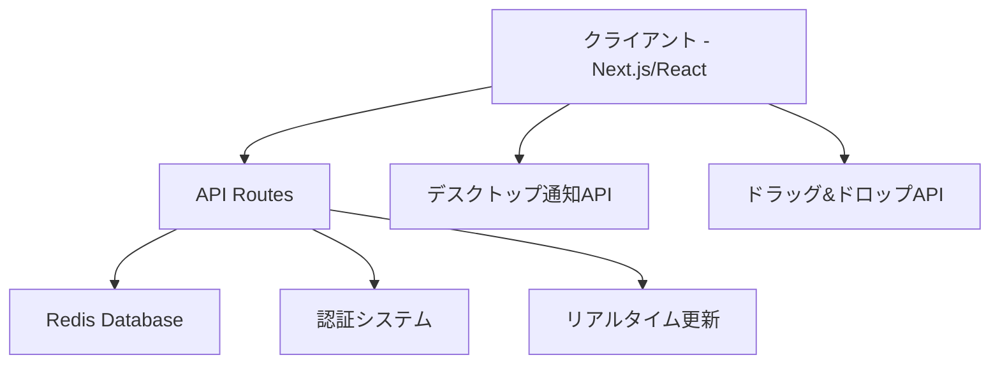

# タスク管理システム設計書

## 概要

高機能なタスク管理システムを構築します。時間追跡、期限管理、カテゴリ分け、デスクトップ通知機能を備えた使いやすいWebアプリケーションです。Next.js、React、TypeScript、Redis、Tailwind CSSを使用して構築します。

## アーキテクチャ

### システム構成



### 技術スタック

- **フロントエンド**: Next.js 15.4.4, React 19.1.0, TypeScript 5
- **スタイリング**: Tailwind CSS 4
- **データベース**: Redis (既存のRedis Cloud接続を使用)
- **認証**: 既存のパスワードベース認証システム
- **状態管理**: React Hooks (useState, useEffect, useContext)
- **ドラッグ&ドロップ**: HTML5 Drag and Drop API
- **通知**: Web Notifications API
- **時間管理**: JavaScript Date API + setInterval

## データモデル

### Task Interface
```typescript
interface Task {
  id: string
  title: string
  description?: string
  categoryId?: string
  targetTime?: number // 分単位
  elapsedTime: number // 分単位
  isRunning: boolean
  startTime?: number // タイムスタンプ
  deadline?: {
    date: string // YYYY-MM-DD
    time?: string // HH:MM (optional)
  }
  order: number // カテゴリ内での順序
  createdAt: number
  updatedAt: number
  completedAt?: number
}
```

### Category Interface
```typescript
interface Category {
  id: string
  name: string
  color: string
  order: number
  createdAt: number
  updatedAt: number
}
```

### Timer Interface
```typescript
interface Timer {
  taskId: string
  startTime: number
  elapsedTime: number
  isRunning: boolean
  targetTime?: number
}
```

## コンポーネント設計

### 1. TasksPage (メインページ)
- **責任**: 全体のレイアウトとデータ管理
- **子コンポーネント**: CategorySection, FloatingCreateButton, TaskModal, CategoryModal
- **状態管理**: タスク一覧、カテゴリ一覧、タイマー状態

### 2. CategorySection
- **責任**: カテゴリごとのタスク表示とドラッグ&ドロップ
- **子コンポーネント**: TaskCard, CategoryCreateButton
- **機能**: カテゴリ内タスクの表示、ドラッグ&ドロップ処理

### 3. TaskCard
- **責任**: 個別タスクの表示と操作
- **子コンポーネント**: Timer, DeadlineDisplay, ActionButtons
- **機能**: タスク情報表示、タイマー制御、完了・削除操作

### 4. Timer
- **責任**: 時間追跡とストップウォッチ機能
- **機能**: start/stop制御、リアルタイム表示、目標時間比較、通知送信

### 5. TaskModal
- **責任**: タスクの作成・編集フォーム
- **機能**: 全フィールドの入力、バリデーション、目標時間選択

### 6. FloatingCreateButton
- **責任**: 左下固定の新規作成ボタン
- **機能**: タスク作成モーダルの表示

### 7. FinishedTasksPage (/tasks/finished)
- **責任**: 完了タスクの表示と分析
- **機能**: 完了日、時間分析、統計表示

## API設計

### タスク管理API
- `GET /api/tasks` - タスク一覧取得
- `POST /api/tasks` - タスク作成
- `PUT /api/tasks/[id]` - タスク更新
- `DELETE /api/tasks/[id]` - タスク削除
- `POST /api/tasks/[id]/complete` - タスク完了
- `POST /api/tasks/[id]/timer/start` - タイマー開始
- `POST /api/tasks/[id]/timer/stop` - タイマー停止
- `PUT /api/tasks/reorder` - タスク順序更新

### カテゴリ管理API
- `GET /api/categories` - カテゴリ一覧取得
- `POST /api/categories` - カテゴリ作成
- `PUT /api/categories/[id]` - カテゴリ更新
- `DELETE /api/categories/[id]` - カテゴリ削除

## Redis データ構造

### タスクデータ
```
tasks:{taskId} -> JSON文字列 (Task interface)
user:tasks -> Set (全タスクIDのセット)
user:active_tasks -> Set (アクティブタスクIDのセット)
user:completed_tasks -> Set (完了タスクIDのセット)
category:{categoryId}:tasks -> Set (カテゴリ別タスクIDのセット)
category:{categoryId}:order -> List (カテゴリ内タスク順序)
uncategorized:order -> List (未分類タスク順序)
```

### カテゴリデータ
```
categories:{categoryId} -> JSON文字列 (Category interface)
user:categories -> Set (全カテゴリIDのセット)
categories:order -> List (カテゴリ表示順序)
```

### タイマーデータ
```
timers:{taskId} -> JSON文字列 (Timer interface)
active_timers -> Set (実行中タイマーのタスクID)
```

## UI/UXデザイン

### デザインシステム
- **カラーパレット**: 
  - Primary: Blue (#3B82F6)
  - Success: Green (#10B981)
  - Warning: Orange (#F59E0B)
  - Danger: Red (#EF4444)
  - Neutral: Gray (#6B7280)

### レイアウト構成
1. **ヘッダー**: タイトル、統計情報、ナビゲーション
2. **カテゴリ管理エリア**: カテゴリ作成・編集
3. **メインコンテンツ**: カテゴリ別タスクセクション
4. **フローティングボタン**: 左下固定のタスク作成ボタン
5. **モーダル**: タスク・カテゴリ作成/編集フォーム

### レスポンシブデザイン
- **デスクトップ**: 3カラムレイアウト
- **タブレット**: 2カラムレイアウト
- **モバイル**: 1カラムレイアウト

## 機能詳細設計

### 時間追跡機能
- **タイマー精度**: 1秒間隔での更新
- **状態管理**: localStorage + Redis での永続化
- **リアルタイム表示**: useEffect + setInterval
- **目標時間超過検知**: 1分間隔でのチェック

### デスクトップ通知機能
- **通知タイミング**: 目標時間超過時
- **通知内容**: タスク名、超過時間
- **権限管理**: 初回アクセス時に通知許可を要求
- **フォールバック**: 通知が無効な場合は画面内アラート

### ドラッグ&ドロップ機能
- **対象**: 同一カテゴリ内のタスク
- **視覚的フィードバック**: ドラッグ中のハイライト
- **制約**: 異なるカテゴリ間の移動は不可
- **永続化**: ドロップ完了時にRedisに保存

### 期限管理機能
- **ソート優先度**: 期限 > カテゴリ > 手動順序
- **期限表示**: 相対時間表示（「2日後」「明日」「今日」）
- **期限アラート**: 期限が近い（24時間以内）タスクのハイライト
- **期限超過**: 赤色表示とアイコン

## エラーハンドリング

### クライアントサイドエラー処理
1. **ネットワークエラー**: 再試行機能とオフライン表示
2. **バリデーションエラー**: フォーム内エラー表示
3. **認証エラー**: ログイン画面へリダイレクト
4. **通知エラー**: 通知権限の再要求

### サーバーサイドエラー処理
1. **Redis接続エラー**: 適切なHTTPステータスコードとエラーメッセージ
2. **データ整合性エラー**: トランザクション的処理
3. **認証エラー**: 401 Unauthorizedレスポンス
4. **バリデーションエラー**: 400 Bad Requestと詳細メッセージ

## パフォーマンス最適化

### フロントエンド最適化
- **React.memo**: 不要な再レンダリング防止
- **useMemo/useCallback**: 計算結果とコールバックのメモ化
- **仮想化**: 大量タスク表示時のパフォーマンス向上
- **遅延読み込み**: 完了タスクページの遅延読み込み

### バックエンド最適化
- **Redis パイプライン**: 複数操作の一括実行
- **キャッシュ戦略**: 頻繁にアクセスされるデータのキャッシュ
- **インデックス最適化**: Redis Setを活用した高速検索
- **接続プール**: Redis接続の効率的な管理

## セキュリティ考慮事項

### 認証・認可
- 既存のパスワードベース認証を継続使用
- セッション管理の強化
- CSRF保護の実装

### データ保護
- Redis接続のTLS暗号化
- 入力値のサニタイゼーション
- XSS対策の実装

### API セキュリティ
- レート制限の実装
- 入力バリデーションの強化
- 適切なHTTPヘッダーの設定

## テスト戦略

### 単体テスト
- **コンポーネントテスト**: React Testing Library
- **API テスト**: Jest + Supertest
- **ユーティリティ関数テスト**: Jest

### 統合テスト
- **API統合テスト**: Redis接続を含む完全なフロー
- **コンポーネント統合テスト**: 親子コンポーネント間の連携

### E2Eテスト
- **主要ユーザーフロー**: タスク作成から完了まで
- **タイマー機能**: 時間追跡の正確性
- **ドラッグ&ドロップ**: 順序変更機能
- **通知機能**: デスクトップ通知の動作

## アクセシビリティ

### キーボードナビゲーション
- 全機能のキーボード操作対応
- 適切なタブ順序の設定
- フォーカス表示の明確化

### スクリーンリーダー対応
- 適切なARIAラベルの設定
- セマンティックHTMLの使用
- 動的コンテンツの適切な通知

### 色覚対応
- 色だけに依存しない情報伝達
- 十分なコントラスト比の確保
- パターンやアイコンの併用
